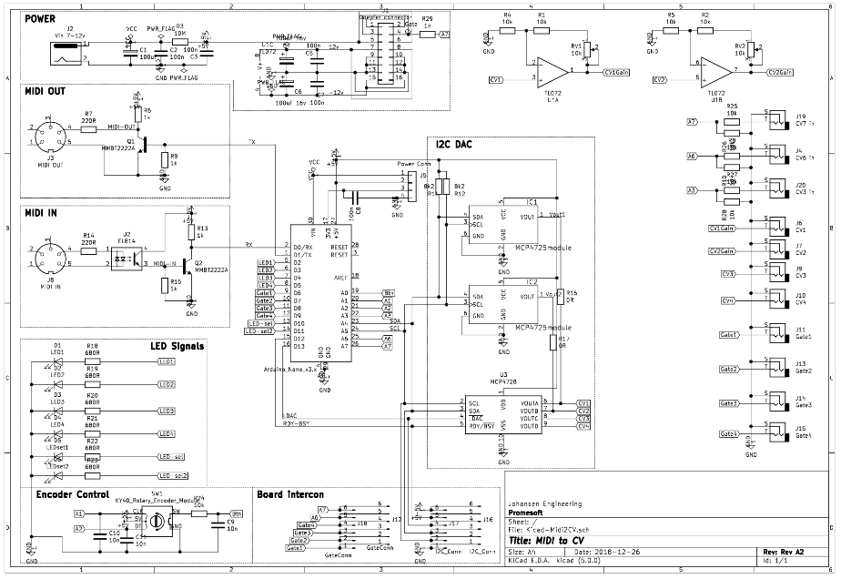
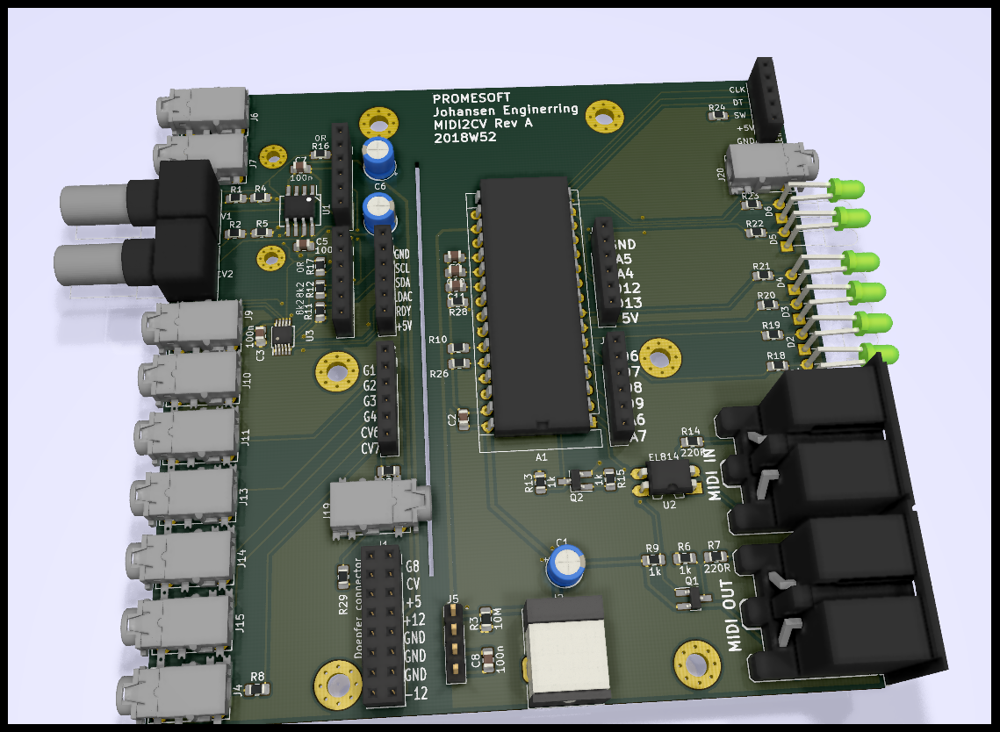

# Kicad-MidiToCV
Midi to CV in Eurorack or as standalone

## Status - Rev A Shipping
### Issues and Notes
Please note that the PIN1 and PIN2 are GATE. This is note described clearly in http://www.doepfer.de/a100_man/a100t_e.htm and needs to be noted when soldering the IDC header or when cabling if a Pin header has been mounted.
### Errata

## Physical Construction
 - 100x100mm
 - Separate unit with no alteration
 - Optional split in 2 for eurorack mount mirrored config

## Vital Components
 - Arduino Nano - where the magic lives (remember to socket it to be able to reprogram it)
 - Jack connectors: PJ-321 (important for the footprint)
 - KY-40 Encoder module (important for the pullup, footprint and 3D alignment)
 - MCP4825 module - if chosen (important for CV out function - footprint needs to match)
 If these are chosen the last two CV jacks should be ommitted.
 - MCP4728 chip - if chosen (important for the last 2 CV out)

## MIDI Board Features
### Single board - MIDI I/O and MIDI to CV
The board can be used as is for a prototype development of MIDI to CV
### Split board Eurorack - MIDI I/O and MIDI to CV
The board can be devided in two and combined front to front with spacers for a MIDI to CV eurorack module.
### Base board Eurorack - MIDI I/O
If only MIDI features are required the base board can work without the IO section.

## Generic Board Features
### Split board Options
The main board (with the arduino) has a couple of headers that can be connected to a different interface board using I2C, Analogue Inputs and Digital I/O.
### Non MIDI board
The MIDI components can be omitted if the features does not require MIDI, like an LFO, VCO or ADSR circuit.

## Base Construction
Arduino Nano based Controller and MIDI decoder.

### MIDI In
MIDI In through a PC814 (or optional PC817) Optocoupler and into the RX pin on the Arduino

### Midi Out
Optional expansion

### Gate
Gate pins from Arduino

## CV Out
I2C Dac with 2 options
### I2C Dac - Option 1 2 Single channel DAC
2x MCP4725 DAC 
### I2C Dac - Option 2 - one 4 channel DAC
1x MCP4728

